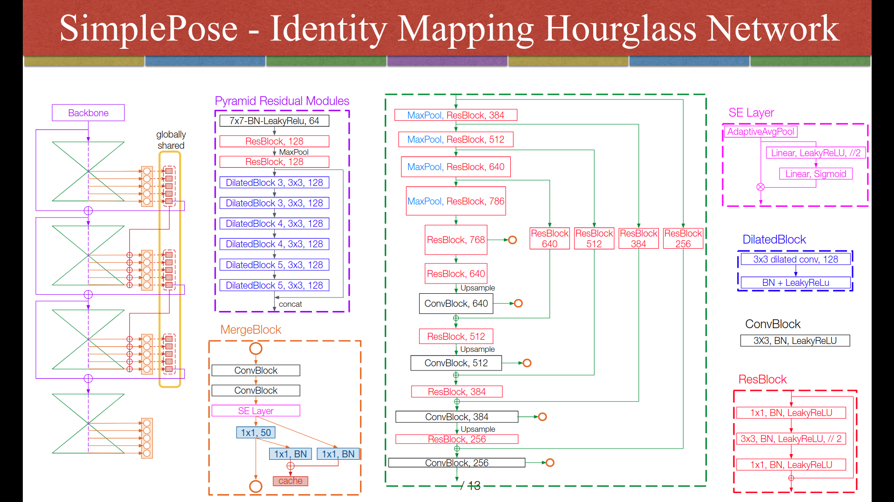

# SimplePose

Code and pre-trained models for our paper, [“Simple Pose: Rethinking and Improving a Bottom-up Approach for Multi-Person Pose Estimation”](https://arxiv.org/abs/1911.10529), accepted by AAAI-2020. 

Also this repo serves as the **Part B** of our paper "Multi-Person Pose Estimation using Body Parts" (under review). The **Part A** is available at [this link](https://github.com/jialee93/Multi-Person-Pose-using-Body-Parts).


## Introduction

A bottom-up approach for the problem of multi-person pose estimation.





### Changed log
* human score calculation: 
  * changed `1 - 1.0 / score` to `score / joint count`. 
  * This increased `0.3 %` AP overall (minival 2017).
* add C++ acceleration for post-processing.
* results of sorting in C++ is different from Python
  * this gives different results accordingly

### Evaluation results
| Changes | Input size | C++ | MS | Flip | AP | AP(M) | AP(L) | AR | AR(M) | AR(L) | fps |
| :-----: | :-----: | :-----: | :-----: | :-----: | :-----: | :-----: | :-----: | :-----: | :-----: | :-----: | :-----: |
| original| 512 | | | v | 65.8 | 59.0 | 75.8 | 69.9 | 61.2 | 82.3 | 2.2 fps |
| refactored | 512 | | | v | 65.8 | 59.0 | 75.9 | 69.9 | 61.2 | 82.5 | 3.3 fps |
| refactored + score calc | 512 | | | v | 66.1 | 59.8 | 76.2 | 69.9 | 61.2 | 82.6 | 
| refactored + score calc| 512 | v | | v | 65.8 | 59.6 | 75.4 | 69.8 | 61.0 | 82.1 | 7.3 fps |
* Tested on `GeForce 2080 Ti x 1`

### Contents

1. Training  
2. Evaluation 
3. Demo

## Project Features

- Implement the models using Pytorch in auto mixed-precision (using Nvidia Apex).
- Supprot training on multiple GPUs (over 90% GPU usage rate on each GPU card).
- Fast data preparing and augmentation during training (generating about **40 samples per second** on signle CPU process and much more if warpped by DataLoader Class).
- Focal L2 loss.
- Multi-scale supervision.
- **This project can also serve as a detailed practice to the green hand in Pytorch.**

## Prepare

1. Install packages:

   Python=3.6, Pytorch>1.0, Nvidia Apex and other packages needed.

2. Download the COCO dataset.

3. Download the pre-trained models (default configuration: download the pretrained model snapshotted at epoch 52 provided as follow).

   Download Link: [BaiduCloud](https://pan.baidu.com/s/1X7nGC-7CliP1iKgIfsBMUg)

   Alternatively, download the pre-trained model without optimizer checkpoint only for the default configuration via: [GoogleDrive](https://drive.google.com/open?id=1gLa2oNxnbFPo0BjnpPaiAmWJwyND8wkA)

4. Compile Cpp files  
   * `cd utils/pafprocess`
   * `sh make.sh`

5. Change the paths in the code according to your environment.

## Run a Demo

`python demo_image.py`


## Inference Speed

The speed of our system is tested on the MS-COCO test-dev dataset. 

- Inference speed of our 4-stage IMHN with 512 × 512 input on one 2080TI GPU: 38.5 FPS (100% GPU-Util). 
- Processing speed of the keypoint assignment algorithm part that is implemented in pure Python and a single process on Intel Xeon E5-2620 CPU: 5.2 FPS (has not been well accelerated). 

## Evaluation Steps

The corresponding code is in pure python without multiprocess for now.

`python evaluate.py` 

## Refactored Python
Results on MSCOCO 2017 minival skeletons with **refactored Python** (focal L2 loss with gamma=2):
```
 Average Precision  (AP) @[ IoU=0.50:0.95 | area=   all | maxDets= 20 ] = 0.661
 Average Precision  (AP) @[ IoU=0.50      | area=   all | maxDets= 20 ] = 0.859
 Average Precision  (AP) @[ IoU=0.75      | area=   all | maxDets= 20 ] = 0.716
 Average Precision  (AP) @[ IoU=0.50:0.95 | area=medium | maxDets= 20 ] = 0.598
 Average Precision  (AP) @[ IoU=0.50:0.95 | area= large | maxDets= 20 ] = 0.762
 Average Recall     (AR) @[ IoU=0.50:0.95 | area=   all | maxDets= 20 ] = 0.699
 Average Recall     (AR) @[ IoU=0.50      | area=   all | maxDets= 20 ] = 0.873
 Average Recall     (AR) @[ IoU=0.75      | area=   all | maxDets= 20 ] = 0.742
 Average Recall     (AR) @[ IoU=0.50:0.95 | area=medium | maxDets= 20 ] = 0.612
 Average Recall     (AR) @[ IoU=0.50:0.95 | area= large | maxDets= 20 ] = 0.825
```
* run about `3` fps using official pretrained model, post-processing included. 

## Refactored Python + Cpp
Results on MSCOCO 2017 minival skeletons (focal L2 loss with gamma=2):
```

 Average Precision  (AP) @[ IoU=0.50:0.95 | area=   all | maxDets= 20 ] = 0.658
 Average Precision  (AP) @[ IoU=0.50      | area=   all | maxDets= 20 ] = 0.856
 Average Precision  (AP) @[ IoU=0.75      | area=   all | maxDets= 20 ] = 0.713
 Average Precision  (AP) @[ IoU=0.50:0.95 | area=medium | maxDets= 20 ] = 0.596
 Average Precision  (AP) @[ IoU=0.50:0.95 | area= large | maxDets= 20 ] = 0.754
 Average Recall     (AR) @[ IoU=0.50:0.95 | area=   all | maxDets= 20 ] = 0.698
 Average Recall     (AR) @[ IoU=0.50      | area=   all | maxDets= 20 ] = 0.872
 Average Recall     (AR) @[ IoU=0.75      | area=   all | maxDets= 20 ] = 0.740
 Average Recall     (AR) @[ IoU=0.50:0.95 | area=medium | maxDets= 20 ] = 0.610
 Average Recall     (AR) @[ IoU=0.50:0.95 | area= large | maxDets= 20 ] = 0.824
```
* run about `7` fps using official pretrained model, post-processing included.

## Official 
Results on MSCOCO 2017 test-dev skeletons (focal L2 loss with gamma=2):

```
 Average Precision  (AP) @[ IoU=0.50:0.95 | area=   all | maxDets= 20 ] = 0.685
 Average Precision  (AP) @[ IoU=0.50      | area=   all | maxDets= 20 ] = 0.867
 Average Precision  (AP) @[ IoU=0.75      | area=   all | maxDets= 20 ] = 0.749
 Average Precision  (AP) @[ IoU=0.50:0.95 | area=medium | maxDets= 20 ] = 0.664
 Average Precision  (AP) @[ IoU=0.50:0.95 | area= large | maxDets= 20 ] = 0.719
 Average Recall     (AR) @[ IoU=0.50:0.95 | area=   all | maxDets= 20 ] = 0.728
 Average Recall     (AR) @[ IoU=0.50      | area=   all | maxDets= 20 ] = 0.892
 Average Recall     (AR) @[ IoU=0.75      | area=   all | maxDets= 20 ] = 0.782
 Average Recall     (AR) @[ IoU=0.50:0.95 | area=medium | maxDets= 20 ] = 0.688
 Average Recall     (AR) @[ IoU=0.50:0.95 | area= large | maxDets= 20 ] = 0.784
```

## Training Steps

Before training, prepare the training data using ''SimplePose/data/coco_masks_hdf5.py''.

Multiple GUPs are recommended to use to speed up the training process, but we support different training options. 

- [x] Most code has been provided already, you can train the model with.

  1.  'train.py': single training process on one GPU only.
  2.  'train_parallel.py': signle training process on multiple GPUs using Dataparallel.
  3.  'train_distributed.py' (**recommended**): multiple training processes on multiple GPUs using Distributed Training:

```shell
python -m torch.distributed.launch --nproc_per_node=4 train_distributed.py
```

> Note:  The *loss_model_parrel.py* is for *train.py* and *train_parallel.py*, while the *loss_model.py* is for *train_distributed.py* and *train_distributed_SWA.py.* They are different in dividing the batch size. Please refer to the code about the different choices. 
>
> For distributed training, the real batch_size = batch_size_in_config* × GPU_Num (world_size actually). For others, the real batch_size = batch_size_in_config*. The differences come form the different mechanisms of data parallel training and distrubited training. 

## Referred Repositories (mainly)

- [Realtime Multi-Person Pose Estimation verson 1](https://github.com/michalfaber/keras_Realtime_Multi-Person_Pose_Estimation)
- [Realtime Multi-Person Pose Estimation verson 2](https://github.com/anatolix/keras_Realtime_Multi-Person_Pose_Estimation)
- [Realtime Multi-Person Pose Estimation version 3](https://github.com/ZheC/Realtime_Multi-Person_Pose_Estimation)
- [Realtime Multi-Person Pose Estimation by tensorboy](https://github.com/tensorboy/pytorch_Realtime_Multi-Person_Pose_Estimation)
- [Associative Embedding](https://github.com/princeton-vl/pose-ae-train)
- [NVIDIA/apex](https://github.com/NVIDIA/apex)

## Citation

Please kindly cite this paper in your publications if it helps your research.

```
@inproceedings{li2019simple,
	title={Simple Pose: Rethinking and Improving a Bottom-up Approach for Multi-Person Pose Estimation},
	author={Jia Li and Wen Su and Zengfu Wang},
	booktitle = {arXiv preprint arXiv:1911.10529},
	year={2019}
}
```
